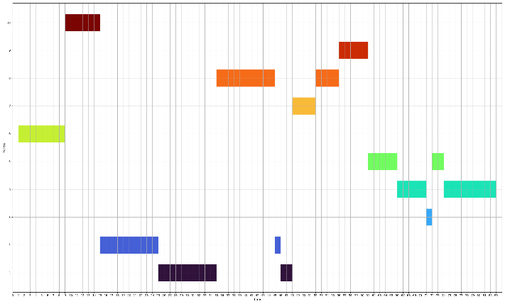

# Dynamic_RR

  - [Hypothesis](#hypothesis)
  - [CPU Utiliation](#cpu-utilization)
  - [Algorithm](#algorithm)
  - [Experiment](#experiment)
  - [Reference](#reference)

## Hypothesis
- 프로세스들을 foreground와 background로 나누지 않고 전부 상호작용적(interactive)으로 작동하는 foreground processes라고 가정
- 각 프로세스에 대한 Arrival Time, Burst Time 제공
---
## CPU Utilization

---
## Algorithm

---
## Experiment
### Case 1
|ID|Arrival Time|Burst Time|
|:-----:|:---:|:---:|
|P1|40|10|
|P2|0|1|
|P3|43|3|
|P4|19|8|
|P5|44|1|
|P6|23|4|
|P7|50|11|
|P8|15|1|
|P9|3|6|
|P10|26|11|

***

### Case 2
|ID|Arrival Time|Burst Time|
|:-----:|:---:|:---:|
|P1|8|12|
|P2|9|11|
|P3|46|1|
|P4|12|14|
|P5|19|7|
|P6|1|8|
|P7|28|4|
|P8|2|14|
|P9|43|5|
|P10|2|6|

***

### Case 3

---
## Reference
- A New Round Robin Based Scheduling Algorithm for Operating Systems: Dynamic Quantum Using the Mean Average-[arxiv.org](https://arxiv.org/pdf/1111.5348.pdf)
- [CPU Scheduling](http://uclab.khu.ac.kr/lectures/2006_1_os/os-ch06.pdf)